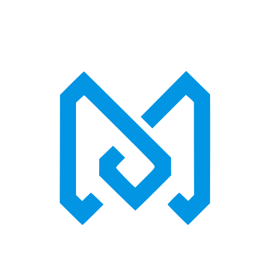
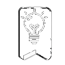
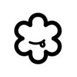

  

<h1 align="center">
  
</h1>

  

  Started coding to build things I wanted to use. Never stopped. 
  I work across the full stack with React, Next.js, Node, and TypeScript. 
  Every project teaches me something new, and that's the whole point. 
  Always open to collaborate on interesting ideas.

---

## What I've Built

<table>
  <tr>
    <td width="50%" valign="top">
      <h3> MarkMind </h3>
    </td>
    <td width="50%" valign="top">
      <h3> FlowMate</h3>
    </td>
  </tr>
  <tr>
    <td valign="top">AI-powered Chrome extension that organizes your bookmarks into folders. One click, zero friction. Open source, no account required.</td>
    <td valign="top">AI email management tool. Turns 200 emails into 5 decisions. Built for people who need inbox zero without the effort.</td>
  </tr>
  <tr>
    <td><a href="https://www.markmind.xyz/">Live Site</a> · <a href="https://chromewebstore.google.com/detail/markmind/bdobgdkpeffdbonfpokgkbncgnbnjnoo">Chrome Store</a> · <a href="https://github.com/Max-Mendes91/markmind-v2-landing">Code</a></td>
    <td><a href="https://www.flowmate.click/">Live Site</a></td>
  </tr>
  <tr>
    <td>   </td>
    <td>  </td>
  </tr>
  <tr>
    <td width="50%" valign="top">
      <h3> Fennaro </h3>
    </td>
    <td width="50%" valign="top">
      <h3> BestEats </h3>
    </td>
  </tr>
  <tr>
    <td valign="top">Mobile app that matches big and working-breed dogs with compatible playmates nearby, by size, energy and temperament. Built solo end to end. Trilingual EN/PL/PT.</td>
    <td valign="top">Food ranking app for Portugal. One best dish per restaurant, decided by votes, not manipulated stars. I contribute features and AI food illustrations under senior code review.</td>
  </tr>
  <tr>
    <td><a href="https://fennaro.com">Live Site</a></td>
    <td><a href="https://besteats.pt">Live Site</a></td>
  </tr>
  <tr>
    <td>   </td>
    <td>   </td>
  </tr>
</table>

---

## Currently Working On

>    are in active development as a team effort. Not live yet. Stay tuned.

---

## Tech Stack

**Frontend**

**Backend**

**DevOps and Tools**

---

## Connect

---

  <em>Always learning, always building.</em>

